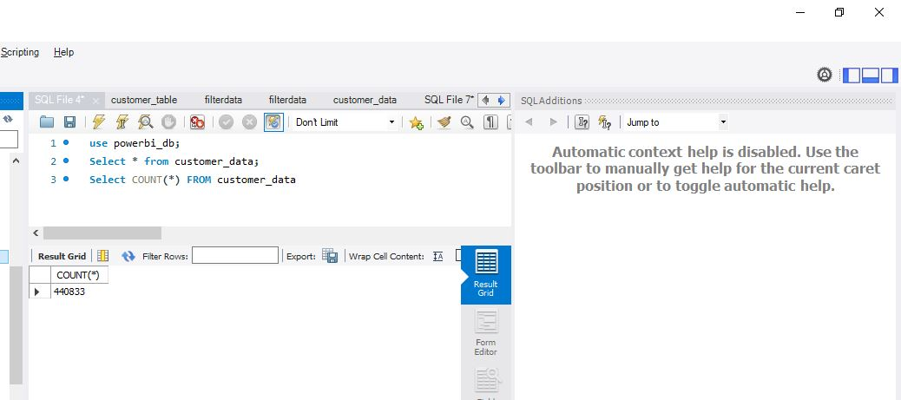
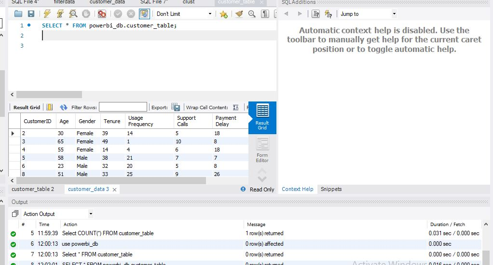
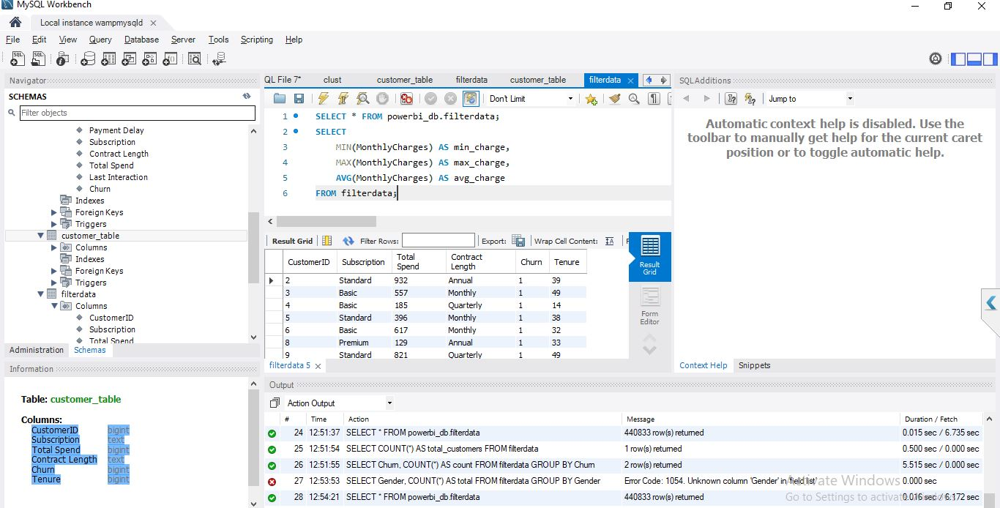

/*
📊 CUSTOMER CHURN ANALYSIS - SQL SCRIPT

Database  : powerbi_db
Purpose   : Data Import, Cleaning, Validation & Analysis
Author    : Gowsi
*/

-- 1️⃣ SET DATABASE
USE powerbi_db;

-- 2️⃣ VIEW RAW DATA
SELECT * FROM customer_data;

SELECT COUNT(*) AS total_records 
FROM customer_data;

-- 3️⃣ IMPORT DATA FROM CSV (RUN IN MYSQL CLI)
/*
NOTE:
Ensure 'local_infile' is enabled before running this command.
*/
LOAD DATA LOCAL INFILE 'D:/Powerbi/PowerbiTraining.csv'
INTO TABLE customer_data
FIELDS TERMINATED BY ','
ENCLOSED BY '"'
LINES TERMINATED BY '\n'
IGNORE 1 ROWS;

-- Screenshot: 

-- 4️⃣ CREATE WORKING TABLE
CREATE TABLE customer_table AS
SELECT * 
FROM customer_data;
SELECT * FROM customer_table;

-- Screenshot: 

-- 5️⃣ DATA CLEANING
DELETE FROM customer_table
WHERE CustomerID IS NULL;

-- 6️⃣ HANDLE MISSING VALUES
UPDATE customer_table
SET TotalCharges = 0
WHERE TotalCharges IS NULL;

-- 7️⃣ DATA VALIDATION
SELECT COUNT(*) AS null_customer_ids
FROM customer_table
WHERE CustomerID IS NULL;

SELECT COUNT(*) AS null_totalcharges
FROM customer_table
WHERE TotalCharges IS NULL;

-- 8️⃣ CREATE FILTERED DATA
CREATE TABLE filterdata AS
SELECT *
FROM customer_table
WHERE tenure > 3;

SELECT * FROM filterdata;

-- 9️⃣ ANALYSIS QUERIES

-- Total Customers
SELECT COUNT(*) AS total_customers 
FROM filterdata;

-- Churn Distribution
SELECT Churn, COUNT(*) AS count
FROM filterdata
GROUP BY Churn;

-- Average Tenure
SELECT AVG(tenure) AS avg_tenure 
FROM filterdata;

-- Monthly Charges
SELECT 
    MIN(MonthlyCharges) AS min_charge,
    MAX(MonthlyCharges) AS max_charge,
    AVG(MonthlyCharges) AS avg_charge
FROM filterdata;

Screenshot: 

-- Gender Distribution
SELECT Gender, COUNT(*) AS total
FROM filterdata
GROUP BY Gender;

Screenshot: 

-- High-Risk Customers
SELECT *
FROM filterdata
WHERE Churn = 'Yes'
  AND MonthlyCharges > 70;

-- 🔟 FINAL CHECK
SELECT COUNT(*) AS final_dataset_count 
FROM filterdata;

-- END
